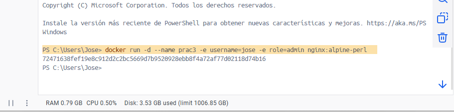

# Variables de Entorno
### ¿Qué son las variables de entorno?

Las variables de entorno en Docker son valores que se pasan al contenedor en tiempo de ejecución para configurar su comportamiento sin modificar la imagen.

### Para crear un contenedor con variables de entorno

```
docker run -d --name <nombre contenedor> -e <nombre variable1>=<valor1> -e <nombre variable2>=<valor2>
```

### Crear un contenedor a partir de la imagen de nginx:alpine con las siguientes variables de entorno: username y role. Para la variable de entorno rol asignar el valor admin.

```
PS C:\Users\Jose> docker run -d --name prac3 -e username=jose -e role=admin nginx:alpine-perl
```



### Crear un contenedor con la imagen de mysql, mapear todos los puertos
```
docker run -d --name mysql-contenedor -e MYSQL_ROOT_PASSWORD=123-Passw0rd -P mysql:latest
```
### ¿El contenedor se está ejecutando?
Sí

### Identificar el problema

no hubo problema alguno 

### Para crear un contenedor con variables de entorno especificadas
- Portabilidad: Las aplicaciones se vuelven más portátiles y pueden ser desplegadas en diferentes entornos (desarrollo, pruebas, producción) simplemente cambiando el archivo de variables de entorno.
- Centralización: Todas las configuraciones importantes se centralizan en un solo lugar, lo que facilita la gestión y auditoría de las configuraciones.
- Consistencia: Asegura que todos los miembros del equipo de desarrollo o los entornos de despliegue utilicen las mismas configuraciones.
- Evitar Exposición en el Código: Mantener variables sensibles como contraseñas, claves API, y tokens fuera del código fuente reduce el riesgo de exposición accidental a través del control de versiones.
- Control de Acceso: Los archivos de variables de entorno pueden ser gestionados con permisos específicos, limitando quién puede ver o modificar la configuración sensible.

### ¿Qué bases de datos existen en el contenedor creado?
```
PS C:\Users\Jose> docker exec -it mysql-contenedor mysql -u root -p -e "SHOW DATABASES;"
Enter password: 
+--------------------+
| Database           |
+--------------------+
| information_schema |
| mysql              |
| performance_schema |
| sys                |
+--------------------+
PS C:\Users\Jose> 
```
