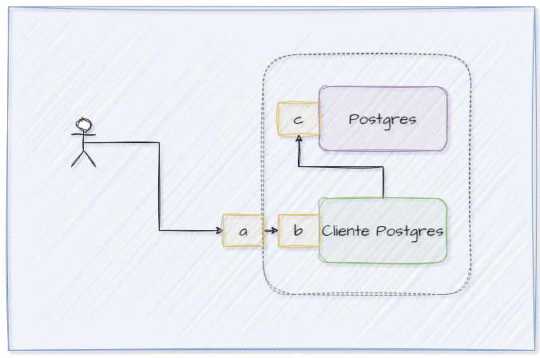
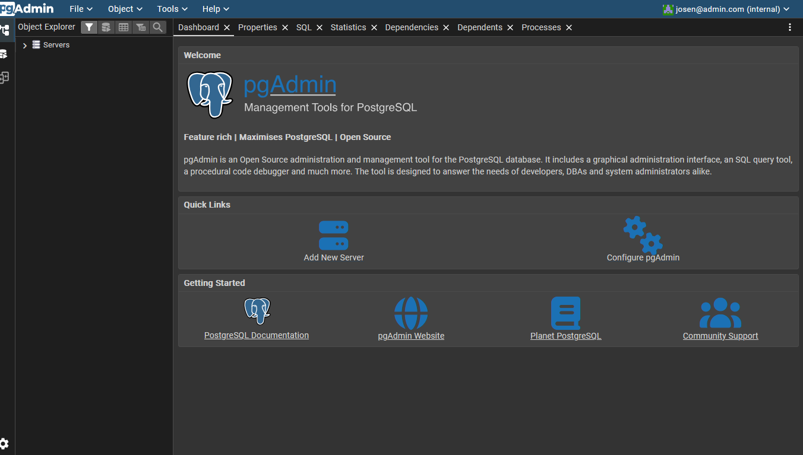
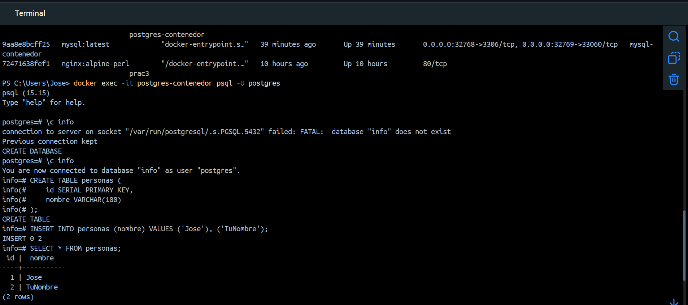

### Crear contenedor de Postgres sin que exponga los puertos. Usar la imagen: postgres:15-alpine3.21
```
docker run -d --name postgres-contenedor -e POSTGRES_PASSWORD=123pass postgres:15-alpine3.21
```
### Crear un cliente de postgres. Usar la imagen: dpage/pgadmin4
```
docker run -d --name pgadmin-cliente -e PGADMIN_DEFAULT_EMAIL=josen@admin.com -e PGADMIN_DEFAULT_PASSWORD=123pass -p 8080:80 dpage/pgadmin4
```
La figura presenta el esquema creado en donde los puertos son:
- a: (8080)
- b: (80)
- c: (5432)



## Desde el cliente
### Acceder desde el cliente al servidor postgres creado.


### Crear la base de datos info, y dentro de esa base la tabla personas, con id (serial) y nombre (varchar), agregar un par de registros en la tabla, obligatorio incluir su nombre.

## Desde el servidor postgresl
### Acceder al servidor
### Conectarse a la base de datos info
```
docker exec -it postgres-contenedor psql -U postgres
CREATE DATABASE info;
\c info
CREATE TABLE personas (
    id SERIAL PRIMARY KEY,
    nombre VARCHAR(100)
);

INSERT INTO personas (nombre) VALUES ('Jose'), ('TuNombre');
SELECT * FROM personas;
```
### Realizar un select *from personas

