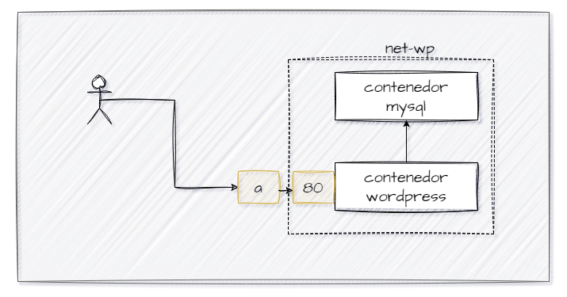
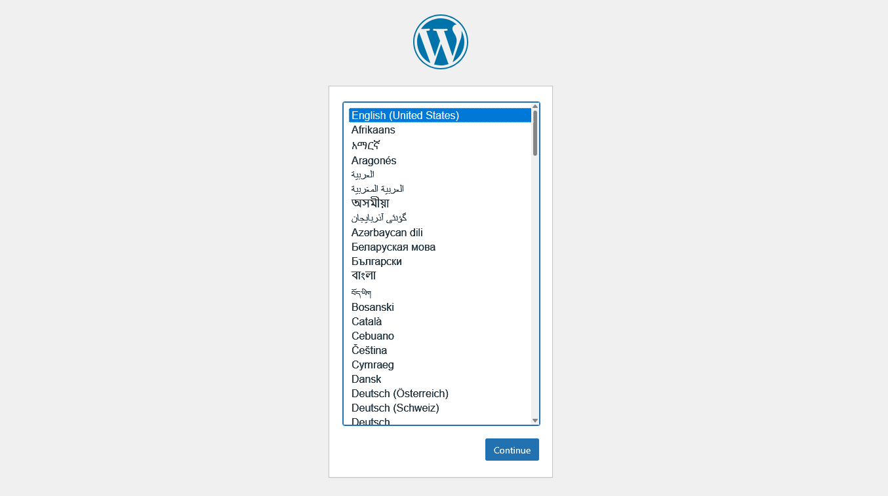
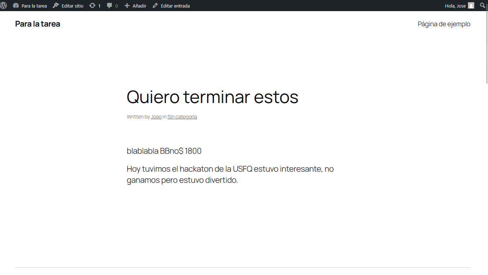

## Esquema para el ejercicio


### Crear la red
```
docker network create red-wp -d bridge
```

### Crear el contenedor mysql a partir de la imagen mysql:8, configurar las variables de entorno necesarias
```
docker run -d --name mysql-wp --network red-wp -e MYSQL_ROOT_PASSWORD=123pass -e MYSQL_DATABASE=wordpress -e MYSQL_USER=wpuser -e MYSQL_PASSWORD=123pass mysql:8
```

### Crear el contenedor wordpress a partir de la imagen: wordpress, configurar las variables de entorno necesarias
```
docker run -d --name wordpress-wp --network red-wp -e WORDPRESS_DB_HOST=mysql-wp:3306 -e WORDPRESS_DB_USER=wpuser -e WORDPRESS_DB_PASSWORD=123pass -e WORDPRESS_DB_NAME=wordpress -p 9300:80 wordpress
```
De acuerdo con el trabajo realizado, en el esquema del ejercicio el puerto a es **(completar con el valor)**

Ingresar desde el navegador al wordpress y finalizar la configuración de instalación.


Desde el panel de admin: cambiar el tema y crear una nueva publicación.
Ingresar a: http://localhost:9300/ 
recordar que a es el puerto que usó para el mapeo con wordpress


### Eliminar el contenedor wordpress
```
docker rm -f wordpress-wp
```

### Crear nuevamente el contenedor wordpress
Ingresar a: http://localhost:9300/ 
recordar que a es el puerto que usó para el mapeo con wordpress

### ¿Qué ha sucedido, qué puede observar?
El contenido (tema y publicación) se mantiene aunque se haya eliminado el contenedor de WordPress, debido a que la información se guarda en la base de datos del contenedor MySQL, el cual no fue eliminado.
